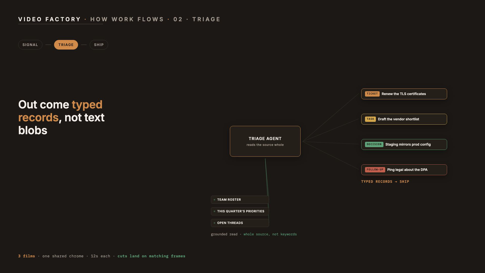

# Video Factory

A prompt-driven [Remotion](https://remotion.dev) studio built to be operated
by [Claude Code](https://claude.com/claude-code). You describe the video;
the agent writes the composition, renders it, extracts frames, looks at
them, and fixes what's wrong before you ever see it.

Two things live here:

1. **Themed compositions** — parameterized video types (quote cards,
   animated data viz) driven by JSON props and a small theme registry.
2. **The Film Series Kit** — a method and toolkit for turning any
   multi-stage process into chained short films that play as one continuous
   machine, with a written deep-dive page pattern to ship them on.



## Quick start

```bash
git clone https://github.com/berober2003/video-factory.git
cd video-factory
npm install
npm run dev          # Remotion Studio — interactive preview
```

Render something:

```bash
npx remotion render src/index.ts QuoteCard out/quote.mp4 \
  --props '{"quote":"Ship early, learn fast","attribution":"Jane Doe","theme":"ember"}'
```

Render the demo film series and open the player:

```bash
npm run render:demo
cp player/player-template.html out/series/index.html
open out/series/index.html
```

## Using it with Claude Code

Open this repo in Claude Code and ask for a video. The repo carries its own
instructions (`CLAUDE.md`) and a project-scoped skill
(`.claude/skills/film-series/`), so the agent already knows the house
method:

> "Build a film series explaining our deployment pipeline: commit, CI,
> canary, rollout. Dark theme, one film per stage."

The agent will write one film per stage on the shared chrome, render them,
extract frames at two beats per film, inspect the pixels for layout
collisions, fix what it finds, and hand you an `out/series/` folder plus a
ready-to-host player page.

The visual QA loop is the point. Generated motion graphics fail in pixels —
text overflowing a card, labels colliding, a wrap you didn't expect — and
none of that is visible in code. The loop here is: render, extract frames,
look, fix, re-render only what changed.

## The Film Series Kit

One long explainer video is a monolith: slow to render, painful to revise
one beat, no random access. A series of ~12-second films, one per stage,
feels like one continuous machine if the seams are engineered away. Four
mechanics do that, and all four are required:

1. **Shared chrome, identical geometry.** Every film renders the same
   title, stage rail, and footer at the same pixels; only the active rail
   chip changes. A cut reads as the process advancing one step.
2. **Scenes fade through the background at both ends** (`filmEnvelope`), so
   every cut lands on a chrome-only frame.
3. **The last film hands off to the first.** Its final beat sends a token
   arcing back to stage 1's chip on the rail. The loop closes narratively.
4. **Double-buffered playback.** Two stacked `<video>` elements; the hidden
   one preloads the next film; swap on `ended`. Gapless cycling plus a
   clickable rail for jumping between stages.

`src/series/shared.tsx` is the whole kit: brand tokens, the `Chrome`
component, motion helpers (`ci`, `win`, `qbez`, `filmEnvelope`), and scene
primitives (`AgentCard`, `Chip`, `EntityCard`, `Stamp`, `CaptionCycle`).
`src/series/demo/` is a working three-film example — fan-in, transform,
fan-out-and-handoff — which is also the shape most real processes reduce to.

## Themes

Two ship in the box: `neutral` (dark, blue accent) and `ember` (warm
charcoal + copper, the film-series look). A theme is 14 tokens in one file
(`src/themes/`), registered in `types.ts`. Add your brand in five minutes.

## Repo map

```
src/compositions/   QuoteCard, DataViz — standalone prop-driven videos
src/series/         Film Series Kit (shared.tsx) + demo series
src/themes/         palette/typography registry
src/components/     shared building blocks (Background, AnimatedText, …)
player/             double-buffered series player template
scripts/            render-series.sh, qa-frames.sh
.claude/skills/     the film-series skill Claude Code auto-loads
CLAUDE.md           agent operating instructions for this repo
```

## Licensing

Code in this repo is MIT.

**Remotion itself is source-available with its own license.** It's free for
individuals, non-profits, and for-profit companies of up to 3 people —
commercial use included. Companies with 4+ people need a
[Remotion Company License](https://www.remotion.dev/docs/license)
(as of mid-2026: $25/month per seat for hand-built videos, or $0.01/render
with a $100/month minimum for automated pipelines — verify current terms at
[remotion.pro](https://remotion.pro)). The license obligation follows
whoever owns the resulting IP, so check your own headcount before adopting
this at work.

## Provenance

Extracted from a private video factory that produces process explainers,
brand data visuals, and chained film series (the pattern was proven on two
production seven-plus-film series before being packaged here). Built and
operated almost entirely by Claude Code.
